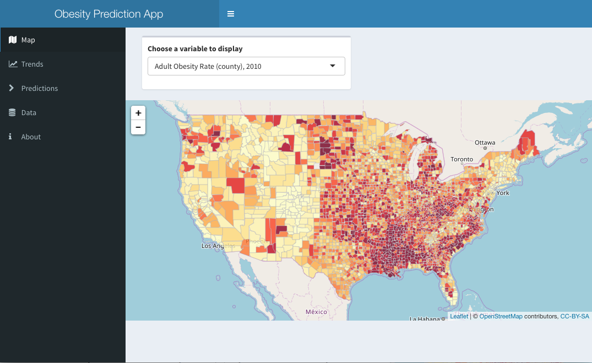

## Obesity Prediction Application

App: This Shiny App gives users the capability to understand the obesity distributin &trends and predict obesity rate. This App would be useful for organizations of health in disease control and medical research. 

#### Data Souce:

Get data from [Food Environment Atlas](https://www.ers.usda.gov/data-products/food-environment-atlas/data-access-and-documentation-downloads.aspx)

***

#### Tools: 

R: shiny, readxl, dplyr, map, leaflet, rgdal, plotly, etc.

***

&copy; Chuan Hong [LinkedIn](https://www.linkedin.com/in/iamchuan/) 
